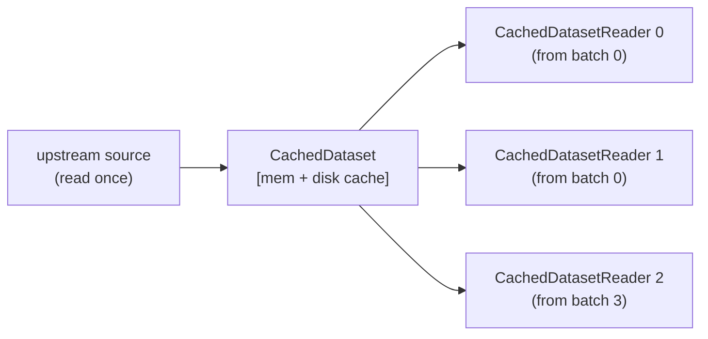

# batchcorder

A Rust-backed Python library for caching Arrow record-batch streams so they can
be replayed multiple times from a source that can only be read once.

## The problem

Arrow `RecordBatchReader` is a single-use stream — once consumed, it is gone.
Training loops and multi-pass data pipelines need to iterate the same dataset
repeatedly without re-reading from disk or the network each time.

## What batchcorder does

`CachedDataset` wraps any Arrow stream source (anything that implements
`__arrow_c_stream__`) and stores each `RecordBatch` in a two-tier hybrid cache
(memory + disk) backed by [Foyer](https://github.com/foyer-rs/foyer).
Multiple independent readers can then replay the stream concurrently, each
maintaining their own position in the batch sequence.



## Installation

Requires a Rust toolchain and [maturin](https://github.com/PyO3/maturin).

```bash
uv sync
maturin develop --uv
```

## Usage

```python
import pyarrow as pa
from batchcorder import CachedDataset

table = pa.table({"x": [1, 2, 3], "y": [4, 5, 6]})

ds = CachedDataset(
    table.to_reader(max_chunksize=1),  # any __arrow_c_stream__ source
    memory_capacity=64 * 1024 * 1024,  # 64 MB
    disk_path="/tmp/batchcorder-cache",
    disk_capacity=512 * 1024 * 1024,  # 512 MB
)

# Replay as many times as needed
for batch in ds:
    print(batch)

# Or get an independent reader handle
reader = ds.reader()
result = pa.RecordBatchReader.from_stream(reader).read_all()

# Pre-ingest everything upfront
ds.ingest_all()
```

### Compatibility

`CachedDataset` and `CachedDatasetReader` implement both `__arrow_c_stream__`
and `__arrow_c_schema__`, so they work with any Arrow-compatible library:

```python
import pyarrow as pa
import duckdb

pa.table(ds)             # PyArrow
pa.table(ds.reader())    # via CachedDatasetReader
duckdb.table("ds")       # DuckDB
```

## Key properties

- **Single-read source**: the upstream stream is consumed exactly once; all
  subsequent reads come from the cache.
- **Concurrent readers**: multiple `CachedDatasetReader` instances from the
  same dataset are fully independent and thread-safe.
- **Lazy ingestion**: batches are fetched from the upstream source on demand as
  readers advance, not upfront.
- **Replay from any position**: `ds.reader(from_start=True)` replays from
  batch 0; `ds.reader(from_start=False)` (default) starts from the frontier
  (next batch not yet ingested).

## Eviction caveat

Foyer evicts cache entries under memory/disk pressure. If an entry is evicted
before a reader reaches it, that reader will raise an error. Size the cache to
hold at least as many batches as the span between the slowest and fastest
concurrent reader.

## Development

```bash
# Install dependencies and build the extension
uv sync
maturin develop --uv

# Run tests
uv run pytest

# Run all pre-commit checks
uv run pre-commit run --all-files
```
