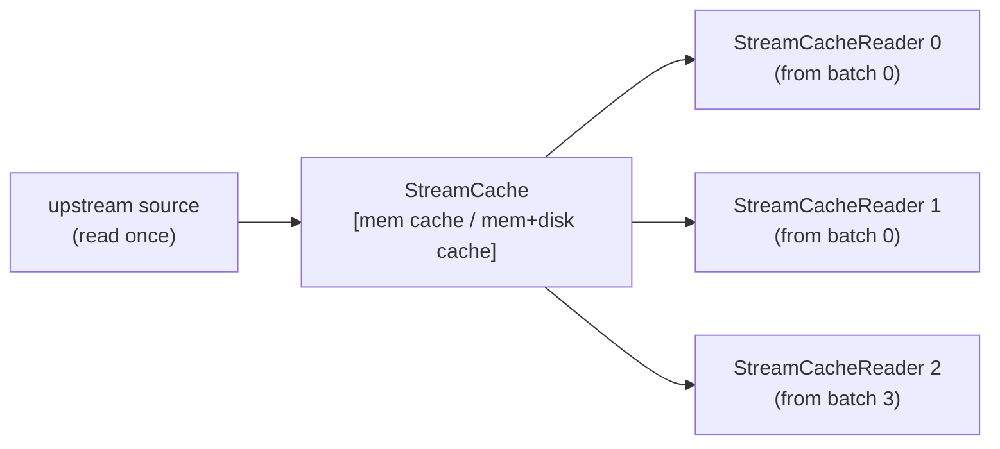

# batchcorder

A Rust-backed Python library for caching Arrow record-batch streams so they can
be replayed multiple times from a source that can only be read once.

## The problem

Arrow `RecordBatchReader` is a single-use stream — once consumed, it is gone.
Training loops and multi-pass data pipelines need to iterate the same stream
repeatedly without re-reading from disk or the network each time.

## What batchcorder does

`StreamCache` wraps any Arrow stream source (anything that implements
`__arrow_c_stream__`) and stores each `RecordBatch` in a
[Foyer](https://github.com/foyer-rs/foyer) cache. Two storage modes are
supported:

- **Memory-only** (default): all batches are kept in RAM; no files are created
  on disk.
- **Hybrid memory+disk**: batches evicted from the memory tier spill to disk,
  allowing the working set to exceed available RAM.

Multiple independent readers can replay the stream concurrently, each
maintaining their own position in the batch sequence.



## Installation

```bash
pip install batchcorder
```

## Usage

```python
import tempfile

import pyarrow as pa

from batchcorder import StreamCache

table = pa.table({"x": [1, 2, 3], "y": [4, 5, 6]})

# Memory-only (default capacity = total physical RAM)
ds = StreamCache(table.to_reader(max_chunksize=1))

# Memory-only with explicit capacity
ds = StreamCache(
    table.to_reader(max_chunksize=1),
    memory_capacity=64 * 1024 * 1024,  # 64 MB
)

# Hybrid memory+disk
tmp = tempfile.mkdtemp()
ds = StreamCache(
    table.to_reader(max_chunksize=1),
    memory_capacity=64 * 1024 * 1024,  # 64 MB in RAM
    disk_path=tmp,
    disk_capacity=512 * 1024 * 1024,  # 512 MB on disk
)

# Replay as many times as needed
for batch in ds:
    print(batch)

# Or get an independent reader handle
reader = ds.reader()
result = pa.RecordBatchReader.from_stream(reader).read_all()

# Pre-ingest everything upfront
ds.ingest_all()
```

### Compatibility

`StreamCache` and `StreamCacheReader` implement both `__arrow_c_stream__`
and `__arrow_c_schema__`, so they work with any Arrow-compatible library:

<!-- skip: next -->
```python
import pyarrow as pa
import duckdb

pa.table(ds)  # PyArrow
pa.table(ds.reader())  # via StreamCacheReader
duckdb.table("ds")  # DuckDB
```

## Key properties

- **Single-read source**: the upstream stream is consumed exactly once; all
  subsequent reads come from the cache.
- **Concurrent readers**: multiple `StreamCacheReader` instances from the
  same stream cache are fully independent and thread-safe.
- **Lazy ingestion**: batches are fetched from the upstream source on demand as
  readers advance, not upfront.
- **Replay from any position**: `ds.reader(from_start=True)` (default) replays
  from batch 0; `ds.reader(from_start=False)` starts from the current ingestion
  frontier (next batch not yet ingested).

## Eviction caveat

Foyer evicts cache entries under memory/disk pressure. If an entry is evicted
before a reader reaches it, that reader will raise an error. Size the cache to
hold at least as many batches as the span between the slowest and fastest
concurrent reader.

## Development

```bash
# Install dependencies and build the extension
uv sync --no-install-project --dev
uv run maturin develop --uv

# Run tests
uv run pytest

# Run all pre-commit checks
uv run pre-commit run --all-files
```
